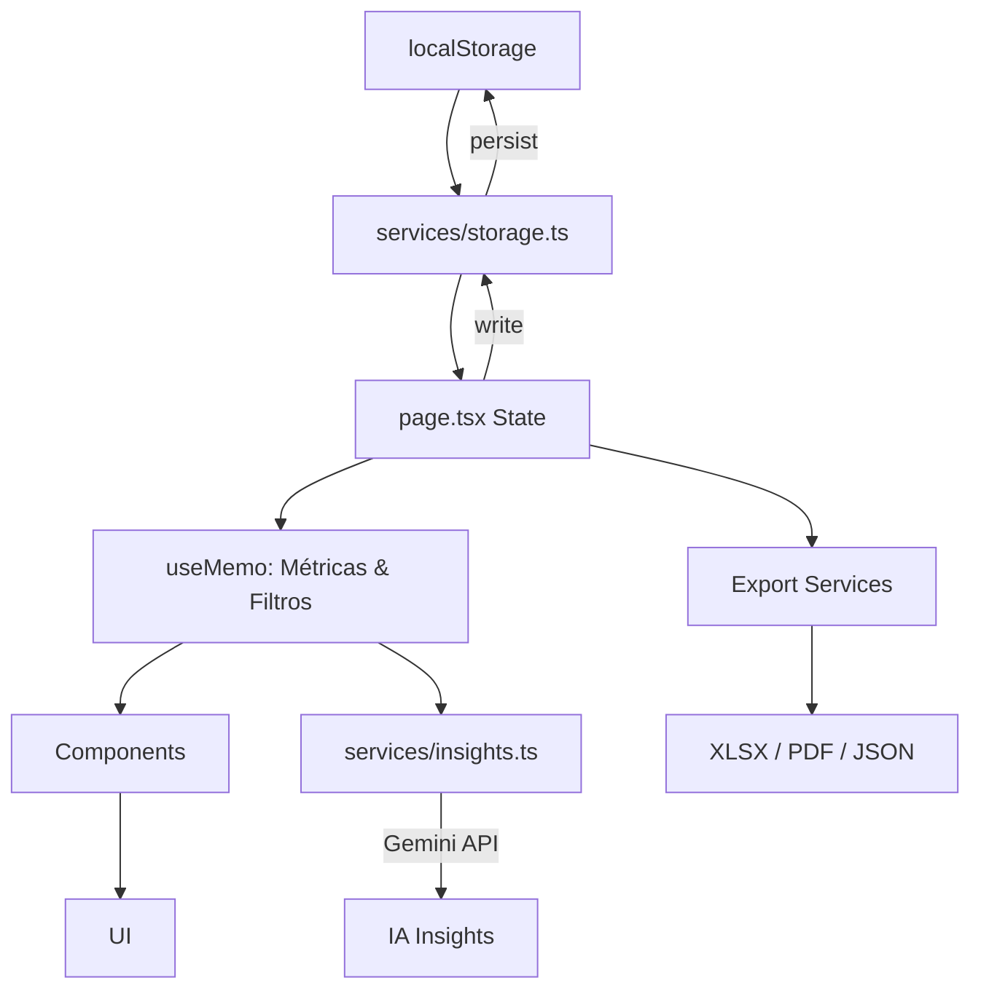

<div align="center">
  
  
  <h1>💎 Nivra</h1>
  <p><strong>Dark Glass Financial Software</strong> — Gestão financeira inteligente com IA, armazenamento local e zero telemetria.</p>
  
  <p>
    <a href="https://github.com/nasac0x/Nivra"></a>
    
    
    
    
    
    
    
  </p>
</div>

---

## 🎯 O que é o Nivra?

**Nivra** é um dashboard financeiro pessoal (Revenue Tracker) construído com foco em **privacidade**, **performance** e **experiência visual refinada**. Diferente de SaaS financeiros tradicionais:

| Característica | Nivra | SaaS Tradicionais |
|----------------|-------|-------------------|
| **Dados** | 100% Local (localStorage/IndexedDB) | Nuvem do provedor |
| **Telemetria** | Zero | Extensa |
| **IA** | Gemini (chave do usuário, local) | Modelos proprietários |
| **Custo** | Gratuito (BYOK) | Assinatura mensal |
| **Offline** | ✅ Completo | ❌ Limitado |
| **Exportação** | PDF, XLSX, JSON (backup total) | Limitado |

---

## ✨ Funcionalidades Principais

### 📊 Dashboard Modular (Drag-and-Drop)
- **11 módulos** arrastáveis, redimensionáveis, ocultáveis
- Larguras: `full`, `half`, `third`, `two-thirds`
- Persistência de layout no localStorage
- Modo edição com toolbar visual

### 💰 Gestão de Receitas
- Lançamentos rápidos (Quick Add) com atalhos de teclado
- Múltiplas moedas: **USD, BRL, EUR** com conversão automática
- Taxas de câmbio editáveis (auto + manual)
- Categorias personalizáveis
- Histórico completo com filtros e busca

### 📈 Visualizações & Métricas
- **Receita Total** com comparação período anterior
- **Gráfico de receita diária** (7d, 30d, 90d, 6m, 1y)
- **Métricas secundárias**: Ticket médio, melhor/pior dia, dia da semana, crescimento %
- **Distribuição por categoria** (donut chart interativo)
- **Metas** semanal, mensal, anual com progresso visual

### 🤖 Insights com IA (Gemini)
- Análise automática de padrões de receita
- Detecção de tendências, anomalias, sazonalidade
- Sugestões acionáveis baseadas nos seus dados
- Executa localmente com sua `GEMINI_API_KEY`

### 🗺️ Workspace Prospects (Bônus)
- Mapa interativo (Google Maps) para prospecção geográfica
- CRUD de prospects com detalhes, status, notas
- Filtros por status, busca textual
- Exportação dedicada

### 📤 Exportação & Backup
| Formato | Escopo |
|---------|--------|
| **XLSX** | Período atual / Histórico completo |
| **PDF** | Relatório formatado (período / completo) |
| **JSON** | Backup total (transações + configurações) |
| **Import JSON** | Restaura backup com validação |

### 🎨 Experiência Visual
- **Dark Glass UI**: Glassmorphism, blur layers, ambient glows
- **Animação de entrada** cinematográfica (NivraIntroAnimation)
- **Tipografia mono** (JetBrains Mono) + editorial (Space Grotesk)
- **Tema roxo/índigo** consistente (`#9B4DFF`, `#7C3AED`)
- Responsivo: mobile → desktop (grid 12 colunas)

---

## 🏗️ Arquitetura

```
Nivra/
├── app/                    # Next.js App Router
│   ├── globals.css         # Design tokens, glass utilities, animations
│   ├── layout.tsx          # Root layout, fontes, metadata
│   └── page.tsx            # Dashboard principal (784 linhas)
├── components/             # 28 componentes React
│   ├── prospect/           # 6 componentes do workspace prospects
│   ├── AddTransactionModal.tsx
│   ├── CategoryDistribution.tsx
│   ├── EditLayoutToolbar.tsx
│   ├── EmptyState.tsx
│   ├── GmpQuotaBanner.tsx
│   ├── GoalsModule.tsx
│   ├── Header.tsx
│   ├── HistoryTable.tsx
│   ├── InsightsModule.tsx
│   ├── MainRevenue.tsx
│   ├── NivraIntroAnimation.tsx
│   ├── NivraLogo.tsx
│   ├── QuickAdd.tsx
│   ├── RevenueChart.tsx
│   ├── SecondaryMetrics.tsx
│   └── SettingsModal.tsx
├── hooks/
│   └── use-mobile.ts       # Breakpoint hook
├── lib/
│   └── utils.ts            # cn(), formatCurrency, date helpers
├── services/               # Camada de negócio (pura, testável)
│   ├── currency.ts         # Conversão, formatação moedas
│   ├── export-pdf.ts       # jsPDF + autoTable
│   ├── export-xlsx.ts      # SheetJS (xlsx)
│   ├── insights.ts         # Lógica de insights + Gemini
│   ├── metrics.ts          # Cálculos estatísticos
│   ├── prospect-storage.ts # Persistência prospects
│   └── storage.ts          # localStorage transactions/settings
├── types/
│   ├── finance.ts          # Tipos core (Transaction, Settings, etc.)
│   └── prospect.ts         # Tipos prospects
├── .gmp_cache/             # Docs framework GMP (referência)
├── package.json
├── tsconfig.json
├── next.config.ts
├── bun.lock
└── README.md
```

### Fluxo de Dados



---

## 🚀 Quick Start

### Pré-requisitos
- **Bun** ≥ 1.0 (recomendado) ou Node.js ≥ 20
- **Chave Gemini API** (grátis em [AI Studio](https://aistudio.google.com/apikey))

### Instalação

```bash
# Clone
git clone https://github.com/nasac0x/Nivra.git
cd Nivra

# Instale dependências (usa bun.lock)
bun install

# Configure variável de ambiente
cp .env.example .env.local
# Edite .env.local e adicione sua GEMINI_API_KEY

# Desenvolvimento
bun dev
# → http://localhost:3000
```

### Variáveis de Ambiente

```env
# .env.local
GEMINI_API_KEY=sua_chave_aqui
# Opcional: override de porta
# PORT=3001
```

### Scripts Disponíveis

```bash
bun dev       # Servidor dev (Turbopack)
bun build     # Build produção
bun start     # Servidor produção
bun lint      # ESLint
bun clean     # Limpa .next
```

---

## 🎹 Atalhos de Teclado

| Atalho | Ação |
|--------|------|
| `N` | Novo lançamento rápido |
| `E` | Alternar modo edição |
| `S` | Abrir configurações |
| `Ctrl/Cmd + E` | Exportar XLSX (período) |
| `Ctrl/Cmd + Shift + E` | Exportar XLSX (completo) |
| `Ctrl/Cmd + P` | Exportar PDF (período) |
| `Escape` | Fechar modais |

---

## 🔧 Configuração Avançada

### Moedas & Câmbio
Em **Configurações → Moedas**, você define:
- Moeda padrão do dashboard
- Taxas USD→BRL, USD→EUR, EUR→BRL
- Modo manual/automático (futuro: fetch de API)

### Categorias
- Adicione/remova em **Configurações → Categorias**
- Usadas no Quick Add, modal completo, filtros

### Metas
- Semanal / Mensal / Anual
- Progresso visual no módulo **Goals**
- Baseado na moeda ativa

### Layout do Dashboard
1. Clique **Editar** (ícone lápis no Header)
2. Arraste módulos (⋮⋮ handle)
3. Clique ⛶ para alternar largura (half ↔ full)
4. Clique 👁 para ocultar/mostrar
5. **Salvar** persiste no localStorage

---

## 🤖 Como funcionam os Insights IA

O módulo **Insights** analisa seus dados locais e chama a API Gemini:

```typescript
// services/insights.ts
generateInsights(transactions, previousTransactions, metrics, period, currency, rates)
```

**Dados enviados ao Gemini** (apenas agregados, nunca transações brutas):
- Totais período atual vs anterior
- Crescimento %, ticket médio, contagem
- Top 5 categorias
- Melhor/pior dia, dia da semana
- Amostra de descrições (máx. 20)

**Tipos de insight retornados:**
- `positive` → Crescimento, metas atingidas
- `trend` → Padrões sazonais, dias da semana
- `caution` → Queda receita, categoria dominante
- `neutral` → Observações gerais

> **Privacidade**: Sua `GEMINI_API_KEY` fica no seu `.env.local` → navegador → API Google. O Nivra não tem backend.

---

## 📦 Deploy

### Vercel (Recomendado)
```bash
bun i -g vercel
vercel --prod
```
Configure `GEMINI_API_KEY` nas **Environment Variables** do projeto Vercel.

### Docker
```dockerfile
FROM oven/bun:1-alpine
WORKDIR /app
COPY package.json bun.lock ./
RUN bun install --frozen-lockfile
COPY . .
RUN bun run build
EXPOSE 3000
CMD ["bun", "start"]
```

### Static Export (GitHub Pages, Netlify, etc.)
```typescript
// next.config.ts
export default {
  output: 'export',
  images: { unoptimized: true },
}
```
> Requer remover `use client` do `page.tsx` e adaptar hooks de localStorage.

---

## 🧪 Testes & Qualidade

```bash
bun lint          # ESLint (flat config)
bun run typecheck # tsc --noEmit (adicione ao package.json)
```

**Estrutura sugerida para testes** (não incluído):
```
├── __tests__/
│   ├── services/
│   │   ├── metrics.test.ts
│   │   ├── currency.test.ts
│   │   └── insights.test.ts
│   └── components/
│       └── ...test.tsx
```

---

## 🗺️ Roadmap

- [ ] **PWA** — Service Worker, instalação, offline total
- [ ] **IndexedDB** — Migração de localStorage para volumes maiores
- [ ] **Multi-contas** — Perfis isolados (pessoal, empresa, etc.)
- [ ] **Recorrências** — Lançamentos automáticos mensais/semanais
- [ ] **Gráficos avançados** — Recharts/Visx com drill-down
- [ ] **Import CSV/OFX** — Bancos brasileiros (CNAB, OFX)
- [ ] **Webhooks** — Notificações push (metas, anomalias)
- [ ] **Temas** — Light, High Contrast, Custom CSS variables
- [ ] **i18n** — EN/PT/ES completos
- [ ] **Testes** — Vitest + Playwright E2E

---

## 🤝 Contribuindo

```bash
# 1. Fork & clone
git clone https://github.com/seu-user/Nivra.git

# 2. Branch
git checkout -b feat/minha-feature

# 3. Desenvolva
bun dev

# 4. Commit semântico
git commit -m "feat: adiciona filtro por categoria no HistoryTable"

# 5. Push & PR
git push origin feat/minha-feature
```

**Padrões:**
- Commits: [Conventional Commits](https://www.conventionalcommits.org/)
- TypeScript strict, ESLint zero warnings
- Componentes: `<ComponentName>.tsx` + `index.ts` barrel
- Styles: Tailwind v4 (CSS-first), design tokens em `globals.css`

---

## 📄 Licença

**MIT License** — Use livremente, inclusive comercialmente.

```
Copyright (c) 2025 nasac0x

Permission is hereby granted, free of charge, to any person obtaining a copy
of this software and associated documentation files (the "Software"), to deal
in the Software without restriction, including without limitation the rights
to use, copy, modify, merge, publish, distribute, sublicense, and/or sell
copies of the Software...
```

---

## 🙏 Créditos & Inspirações

- **Google AI Studio** — Template base exportado
- **shadcn/ui** — Padrões de componentes acessíveis
- **TailwindCSS v4** — CSS-first, design tokens nativos
- **Lucide React** — Ícones consistentes
- **Motion (Framer)** — Animações fluidas
- **jsPDF + SheetJS** — Exportação client-side
- **Vis.gl Google Maps** - React wrapper oficial

---

## 📞 Contato & Suporte

- **Issues**: [GitHub Issues](https://github.com/nasac0x/Nivra/issues) — Bugs, features, dúvidas
- **Discussions**: [GitHub Discussions](https://github.com/nasac0x/Nivra/discussions) — Ideias, showcases
- **Email**: nasac0x@proton.me

---

<div align="center">
  <sub>Built with ❤️ using <a href="https://nextjs.org">Next.js 15</a>, <a href="https://react.dev">React 19</a>, <a href="https://tailwindcss.com">TailwindCSS 4</a>, <a href="https://bun.sh">Bun</a> and <a href="https://ai.google.dev">Gemini AI</a>.</sub>
  <br />
  <sub>💎 <strong>NIVRA</strong> — DARK GLASS FINANCIAL SOFTWARE</sub>
</div>
